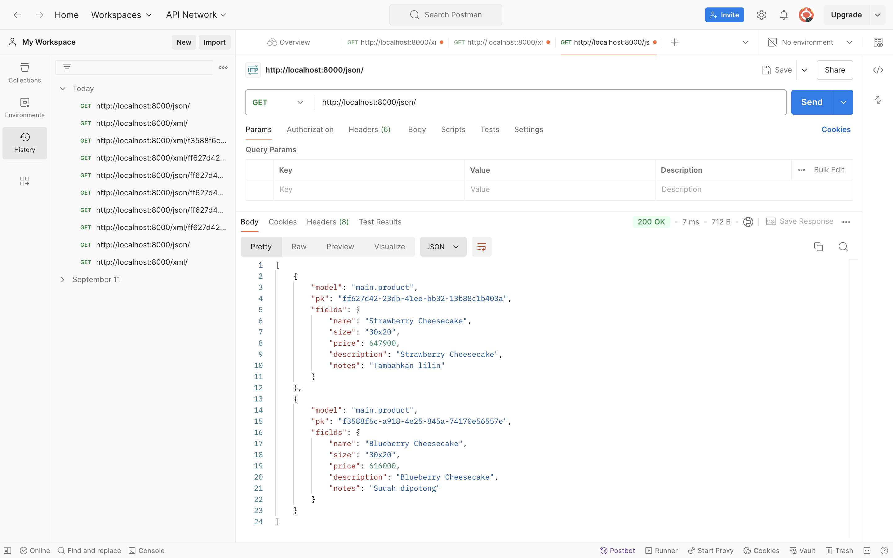
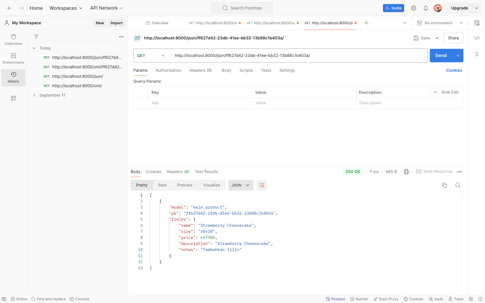
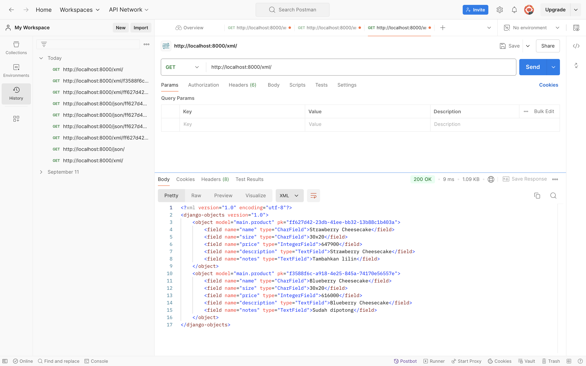
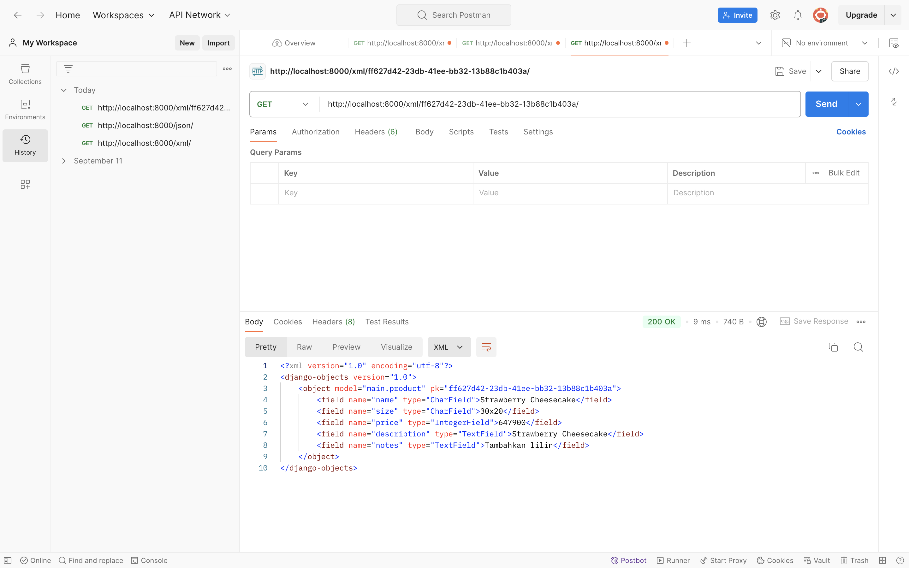

# Cheesecake Store

# Link PWS: http://shintia-dharma-cheesecakestore2.pbp.cs.ui.ac.id/

[Tugas 1](#tugas-1)
[Tugas 2](#tugas-2)
[Tugas 3](#tugas-3)

# Tugas 1 #

# 1. Jelaskan bagaimana cara kamu mengimplementasikan checklist di atas secara step-by-step (bukan hanya sekadar mengikuti tutorial)
- Membuat sebuah proyek django baru dengan melakukan startproject
- Membuat aplikasi dengan nama main
- Melakukan routing pada proyek. Pada file urls.py di proyek utama, saya menambahkan routing agar aplikasi main dapat dijalankan
- Di dalam models.py di aplikasi main, saya membuat model product dengan atribut wajib dan atribut lainnya
- Pada views.py, saya membuat fungsi show_main yang mengambil data dari model Product dan mengirimkannya ke template HTML (main.html) untuk dirender
- Setelah aplikasi selesai, saya melakukan deployment ke PWS dengan menjalankan 'git push pws main:master'

# 2. Buatlah bagan yang berisi request client ke web aplikasi berbasis Django beserta responnya dan jelaskan pada bagan tersebut kaitan antara urls.py, views.py, models.py, dan berkas html

- urls.py: Menerima request dari client dan memetakan URL yang diminta ke fungsi yang sesuai di views.py.
- views.py: Menangani logika aplikasi. View ini mengambil data dari models.py jika diperlukan dan mengirimkan data tersebut ke template HTML.
- models.py: Berhubungan dengan database, merepresentasikan tabel, dan digunakan oleh view untuk mengambil atau memanipulasi data dari database.
- Template HTML: Merender data yang dikirim oleh view menjadi halaman web dinamis dan mengirimkan respon HTML ke client.

# 3. Jelaskan fungsi git dalam pengembangan perangkat lunak!
Git adalah sistem kontrol versi terdistribusi yang digunakan untuk melacak perubahan kode. Berikut adalah beberapa fungsi penting Git dalam pengembangan perangkat lunak:
- Version Control: Git memungkinkan pengembang melacak setiap perubahan pada kode, sehingga dapat melihat riwayat perubahan dan melakukan rollback jika terjadi kesalahan.
- Collaboration: Git memungkinkan pengembang bekerja bersama di satu proyek dengan menggunakan branch untuk mengembangkan fitur baru tanpa mengganggu kode utama.
- Backup dan Recovery: Dengan Git, semua perubahan tersimpan secara terstruktur dan dapat dipulihkan kapan saja.
- Distributed Development: Setiap pengembang memiliki salinan penuh dari repositori, sehingga mereka dapat bekerja secara offline dan melakukan sinkronisasi ketika siap.

# 4. Menurut Anda, dari semua framework yang ada, mengapa framework Django dijadikan permulaan pembelajaran pengembangan perangkat lunak?
Framework Django dijadikan permulaan pembelajaran pengembangan perangkat lunak karena:
- Struktur yang Terorganisir: Django menggunakan arsitektur Model-View-Template (MVT), yang memisahkan logika bisnis, tampilan, dan data. Hal ini membantu pemula memahami konsep pemrograman yang terstruktur.
- Banyak Fitur Bawaan: Django memiliki banyak fitur bawaan seperti ORM, sistem autentikasi, dan admin interface, yang memudahkan pemula untuk langsung membangun aplikasi tanpa banyak konfigurasi.
- Dokumentasi Lengkap: Dokumentasi Django sangat lengkap dan dirancang untuk pemula, sehingga memudahkan pembelajaran.
- Komunitas Besar: Django memiliki komunitas yang aktif, sehingga tersedia banyak sumber daya, tutorial, dan forum untuk belajar dan bertanya.

# 5. Mengapa model pada Django disebut sebagai ORM?
Model pada Django disebut sebagai ORM (Object-Relational Mapping) karena model tersebut berfungsi sebagai penghubung antara database relasional dan objek Python. ORM memungkinkan pengembang berinteraksi dengan database menggunakan objek Python alih-alih menulis query SQL secara manual. ORM memetakan tabel di database ke kelas Python, dan setiap baris dalam tabel menjadi objek Python, sehingga lebih mudah untuk bekerja dengan data.
Dengan menggunakan ORM, kita dapat melakukan operasi CRUD (Create, Read, Update, Delete) dengan objek Python secara efisien tanpa harus menulis query SQL langsung.

# Tugas 2 #

# 1. Jelaskan mengapa kita memerlukan data delivery dalam pengimplementasian sebuah platform?
Data delivery dibutuhkan untuk memastikan informasi dapat ditransmisikan antara berbagai komponen platform, memungkinkan interaksi antar sistem, pengguna, dan layanan eksternal secara real-time. Tanpa mekanisme pengiriman data yang baik, platform tidak akan mampu memberikan respons real-time atau menampilkan informasi yang akurat kepada pengguna. Ini sangat penting untuk aplikasi yang interaktif atau berbasis data seperti e-commerce atau layanan berbasis web lainnya.

# 2. Menurutmu, mana yang lebih baik antara XML dan JSON? Mengapa JSON lebih populer dibandingkan XML?
- XML (Extensible Markup Language): Dikenal karena fleksibilitasnya dan strukturnya yang berbasis tag. XML sering digunakan dalam sistem legacy dan mendukung fitur kompleks seperti atribut, namespace, dan skema.
- JSON (JavaScript Object Notation): Lebih ringan dan mudah dibaca oleh manusia. JSON lebih simpel karena formatnya berupa pasangan kunci-nilai, mirip dengan objek di bahasa pemrograman JavaScript.
- JSON lebih populer dibandingkan XML karena ringan dan efisien, lebih mudah dibaca dan ditulis, pupolaritas javaScript, pemrosesan lebih cepat, dan kompatibilitas API modern.
    
# 3. Jelaskan fungsi dari method is_valid() pada form Django dan mengapa kita membutuhkan method tersebut?
Fungsi is_valid() pada form Django berfungsi untuk memeriksa apakah data yang dimasukkan dalam form memenuhi validasi yang telah didefinisikan. Mengapa kita membutuhkan id_valid():
- Untuk memastikan bahwa data yang diterima dari pengguna tidak salah atau rusak sebelum disimpan ke dalam database.
- Untuk meminimalkan kemungkinan error atau kerentanan, seperti data yang tidak sesuai dengan tipe yang diharapkan.
- Tanpa is_valid(), aplikasi akan berisiko menerima data yang salah atau tidak aman, yang dapat menyebabkan error atau kegagalan dalam aplikasi.

# 4. Mengapa kita membutuhkan csrf_token saat membuat form di Django? Apa yang dapat terjadi jika kita tidak menambahkan csrf_token pada form Django? Bagaimana hal tersebut dapat dimanfaatkan oleh penyerang?
csrf_token (Cross-Site Request Forgery token) adalah mekanisme keamanan yang digunakan untuk melindungi aplikasi dari serangan CSRF. Ini adalah serangan di mana seorang penyerang mencoba membuat pengguna yang terautentikasi melakukan tindakan yang tidak diinginkan di aplikasi web tanpa sepengetahuan mereka.
- Kita membutuhkan csrf_token untuk memastikan bahwa form hanya dapat dikirim oleh pengguna yang memiliki hak akses yang valid dan tidak dimanipulasi oleh pihak ketiga. Django menggunakan csrf_token untuk memverifikasi bahwa permintaan yang dikirim ke server berasal dari sumber yang sah (yaitu pengguna yang mengunjungi aplikasi tersebut).
- Jika kita tidak menambahkan csrf_token maka Aplikasi akan rentan terhadap serangan CSRF, di mana penyerang bisa membuat permintaan palsu atas nama pengguna yang terautentikasi. 

# 5. Jelaskan bagaimana cara kamu mengimplementasikan checklist di atas secara step-by-step (bukan hanya sekadar mengikuti tutorial).
- Dimulai dengan membuat base.html sebagai template dasar yang dapat digunakan sebagai kerangka umum untuk halaman web lainnya di dalam proyek.
- Kemudian mengubah kode pada main.html menggunakan base.html sebagai template utama.
- Mmebuat berkas baru pada direktori main dengan nama forms.py untuk membuat struktur form yang dapat menerima data menu baru. 
- Menambahkan 4 fungsi views baru untuk melihat objek yang sudah ditambahkan dalam format XML, JSON, XML by ID, dan JSON by ID.
- Selanjutnya adalah mengembalikan data-data tersebut dalam bentuk XML dan juga JSON
- Kemudian mengakses keempat URL menggunakan Postman lalu di screenshot.
- Dan yang terakhir adalah meng-add, commit, dan push ke GitHub

# Screenshot Postman

# Tugas 3 #

# 1. Apa perbedaan antara HttpResponseRedirect() dan redirect()?
- HttpResponseRedirect(): Merupakan kelas respons HTTP bawaan Django yang digunakan untuk mengarahkan (redirect) pengguna ke URL tertentu. Pada dasarnya, ini membuat respons HTTP dengan status 302 (Moved Temporarily) dan memberi tahu browser untuk mengunjungi URL yang ditentukan.
- redirect(): Fungsi yang lebih high-level di Django yang secara internal menggunakan HttpResponseRedirect. Fungsi ini lebih fleksibel karena kita bisa melewatkan URL, nama view, atau objek model, kemudian Django akan mencari URL yang tepat.
Sehinnga redirect() lebih fleksibel, sementara HttpResponseRedirect() hanya menerima URL sebagai argumen.

# 2. Jelaskan cara kerja penghubungan model MoodEntry dengan User!
Untuk menghubungkan model MoodEntry dengan User, Django menggunakan relasi ForeignKey. Dengan relasi ini, setiap entri MoodEntry bisa dihubungkan dengan pengguna yang membuat entri tersebut.
- ForeignKey(User, on_delete=models.CASCADE) berarti bahwa setiap objek MoodEntry berhubungan dengan satu objek user.
- Parameter on_delete=models.CASCADE berarti bahwa jika pengguna dihapus, semua MoodEntry yang terkait juga akan dihapus (cascade deletion).

# 3. Apa perbedaan antara authentication dan authorization, apakah yang dilakukan saat pengguna login? Jelaskan bagaimana Django mengimplementasikan kedua konsep tersebut.
- Authentication (Otentikasi): Proses untuk memverifikasi identitas pengguna melalui kombinasi username dan password. Django menggunakan backend otentikasi yang mengelola proses login pengguna. Django menyediakan metode seperti authenticate() untuk memverifikasi kredensial.
- Authorization (Otorisasi): Proses menentukan hak akses pengguna terhadap fitur tertentu setelah pengguna berhasil diotentikasi. Django menggunakan permission framework yang menentukan apa yang dapat dilakukan pengguna. Dengan menggunakan User dan Group, kita bisa memberikan izin (permission) tertentu untuk setiap pengguna.
- Pengguna login: Saat pengguna login, otentikasi dilakukan dengan memverifikasi kredensial (biasanya username dan password) menggunakan model pengguna Django (User), biasanya dengan authenticate() dan login().

# 4. Bagaimana Django mengingat pengguna yang telah login? Jelaskan kegunaan lain dari cookies dan apakah semua cookies aman digunakan?
Django menggunakan sessions untuk mengingat pengguna yang telah login. Setiap pengguna yang login mendapatkan sesi unik yang diidentifikasi oleh cookies. Cookies ini akan disimpan di browser pengguna, dan Django menggunakan ID cookies ini untuk mencari data sesi di server.
- Saat pengguna login, Django membuat entri sesi di database dan menyimpan informasi tentang pengguna di sana. Cookies di browser berisi referensi ke sesi ini.
- Ketika pengguna melakukan permintaan berikutnya, Django memeriksa ID sesi di cookie untuk memulihkan informasi pengguna.

Kegunaan lain dari cookies:
- Melacak pengaturan preferensi pengguna.
- Menyimpan informasi non-sensitif.

Tidak semua cookies aman digunakan. Cookies yang tidak dienkripsi dan tidak disetel sebagai "secure" atau "HttpOnly" bisa rentan terhadap serangan.
- Secure: Cookies hanya dikirimkan melalui koneksi HTTPS.
- HttpOnly: Cookie tidak dapat diakses melalui JavaScript (melindungi dari serangan XSS).

# 5. Jelaskan bagaimana cara kamu mengimplementasikan checklist di atas secara step-by-step (bukan hanya sekadar mengikuti tutorial).
- Dimulai dengan mengaktifkan virtual environment
- Kemudian menambahkan formulir registrasi akun dan membuat mekanisme register
- Mengimport fungsi authenticate dan login pada views.py untuk melakukan autentikasi dan login (jika autentikasi berhasil)
- Menambahkan form login akun dan membuat mekanisme login
- Menambahkan import logout dan fungsi logout_user untuk melakukan mekanisme logout
- Mengimport login_required pada views.py dan menambahkan potongan kode @login_required(login_url='/login') di atas fungsi show_main agar halaman main hanya dapat diakses oleh pengguna yang sudah login (terautentikasi)
- Menambahkan potongan kode 'last_login': request.COOKIES['last_login'] ke dalam variabel context pada views.py untuk menambahkan informasi cookie last_login pada response yang akan ditampilkan di halaman web
- Menghubungkan setiap objek MoodEntry yang akan dibuat dengan pengguna yang membuatnya, sehingga pengguna yang sedang terotorisasi hanya melihat mood entries yang telah dibuat sendiri
- Dan yang terakhir adalah meng-add, commit, dan push ke GitHub

# Screenshot dua akun pengguna dengan masing-masing tiga dummy #

